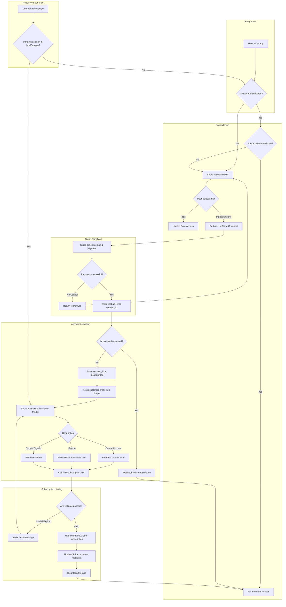

# Pay First, Create Account After - User Journey

## Overview

This document describes the user flow for anonymous users who pay for a subscription before creating an account.

## User Journey Diagram



## Detailed Steps

### 1. Initial Visit (Anonymous User)
1. User lands on the app
2. App checks authentication state
3. If not authenticated and hasn't dismissed paywall, show PaywallModal

### 2. Plan Selection
1. User sees three options: Free, Monthly ($4.99), Yearly ($49.99)
2. If "Free" selected → dismiss paywall, limited access
3. If paid plan selected → redirect to Stripe Checkout

### 3. Stripe Checkout
1. Stripe hosted checkout page collects:
   - Email address
   - Payment method
   - Billing address
2. On success → redirect to `/?checkout=success&session_id=xxx`
3. On cancel → redirect to `/?checkout=cancel`

### 4. Post-Payment (Unauthenticated)
1. App detects `checkout=success` URL parameter
2. Checks if user is authenticated
3. If NOT authenticated:
   - Store `session_id` in localStorage
   - Fetch customer email from `/session-status` API
   - Show ActivateSubscriptionModal

### 5. Account Creation/Sign-In
1. User sees success message: "Payment Successful!"
2. Email field pre-filled from Stripe
3. User can:
   - Create new account (email + password)
   - Sign in to existing account
   - Use Google Sign-In

### 6. Subscription Linking
1. After authentication, app calls `/link-subscription` API
2. Backend validates:
   - Session exists and payment completed
   - Session not already linked to different user
3. Backend updates:
   - Firebase user document with subscription data
   - Stripe customer metadata with `firebaseUserId`
4. Clear localStorage pending session
5. Grant premium access

## State Persistence

### localStorage Keys
| Key | Purpose |
|-----|---------|
| `pending_checkout_session` | Stripe session ID awaiting account creation |
| `pending_checkout_email` | Customer email from Stripe for pre-fill |
| `focusflow_paywall_closed` | User has dismissed initial paywall |

### Recovery Scenarios

**Page Refresh After Payment:**
- App checks localStorage on mount
- If `pending_checkout_session` exists and user not authenticated
- Automatically show ActivateSubscriptionModal

**Browser Closed After Payment:**
- Same as above - localStorage persists
- User can return later to complete account creation

## API Endpoints

### POST /link-subscription
Links a Stripe checkout session to a Firebase user.

**Request:**
```json
{
  "sessionId": "cs_xxx",
  "userId": "firebase-uid"
}
```

**Response (Success):**
```json
{
  "success": true
}
```

**Response (Already Linked):**
```json
{
  "success": true,
  "alreadyLinked": true
}
```

**Response (Error):**
```json
{
  "error": "Payment not completed"
}
```

## Security Considerations

1. **Session Validation**: Backend always verifies payment status with Stripe
2. **Double-Linking Prevention**: Checks if session already linked to another user
3. **Metadata Updates**: Stripe customer/subscription updated with Firebase UID for webhook reliability
4. **No Sensitive Data in localStorage**: Only session ID stored, not payment details

